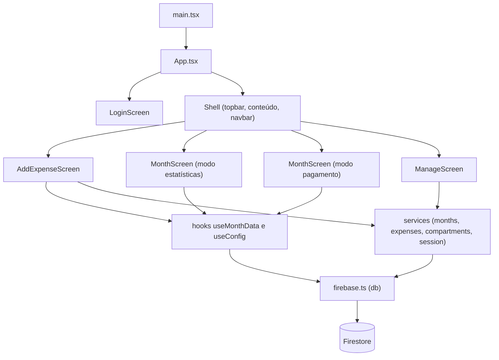

# 1. Arquitetura

## 1.1 Visão geral

O Cash Organizer Web é um SPA que fala **direto com o Firestore**, sem backend
próprio e sem servidor de API. Não há autenticação do Firebase Auth: o controle
de acesso é o par nome + senha do compartimento, validado no cliente contra o
hash guardado no documento do compartimento.

As regras de segurança e as functions do Firebase vivem em outro repositório,
`cash-organizer-functions`. Alterações de permissão de leitura e escrita não são
feitas aqui.



## 1.2 Estrutura de pastas

```
src/
  main.tsx                  boot do React e registro do service worker
  App.tsx                   sessão, shell, navegação entre as quatro telas
  firebase.ts               initializeApp e initializeFirestore com cache offline
  styles.css                folha de estilo global única (todo o CSS do app)
  types.ts                  tipos de domínio e ENTRY_STATUSES
  components/
    LoginScreen.tsx         entrada e criação de compartimento
    AddExpenseScreen.tsx    tela principal de novo gasto
    MonthScreen.tsx         mês corrente: pagamento e estatísticas
    ManageScreen.tsx        cadastro de fixos e categorias
    StatsView.tsx           subtela de estatísticas usada pelo MonthScreen
    MonthlyComparisonCard.tsx  card de comparativo mensal (reutilizado)
    shared.tsx              componentes genéricos reutilizáveis
  hooks/
    useMonthData.ts         useMonthData e useConfig (assinaturas em tempo real)
  services/
    compartments.ts         criar, abrir e buscar compartimento
    session.ts              sessão no localStorage
    months.ts               ciclo de vida do mês e cálculo de totais
    expenses.ts             lançamentos, gastos fixos, categorias e linhas do mês
  utils/
    crypto.ts               SHA-256 da senha e AES-GCM da sessão
    dates.ts                chaves de mês e dia, semana do mês, rótulos pt-BR
    money.ts                formatBRL e digitsToCents
public/icons/               ícones do PWA
.github/workflows/deploy.yml  build e deploy no GitHub Pages
```

## 1.3 Camadas e responsabilidades

| Camada | Onde | Pode fazer | Não pode fazer |
|---|---|---|---|
| Boot | `main.tsx` | montar o React, registrar o service worker | lógica de negócio |
| Aplicação | `App.tsx` | restaurar sessão, escolher a tela, guardar o mês corrente | ler ou escrever no Firestore direto |
| Telas | `components/*Screen.tsx` | estado de formulário, chamadas a serviços, montagem visual | montar query do Firestore |
| Componentes genéricos | `components/shared.tsx` | UI sem conhecimento de domínio | importar serviços ou tipos de domínio |
| Hooks | `hooks/useMonthData.ts` | assinar coleções com `onSnapshot` e devolver estado | escrever no banco |
| Serviços | `services/*.ts` | toda leitura e escrita no Firestore, regras de consistência | renderizar JSX |
| Utilitários | `utils/*.ts` | funções puras, sem React e sem Firestore | acessar `db` |

Regra prática: se um componente precisa de `collection`, `doc` ou `onSnapshot`,
a função está no lugar errado. Ela pertence a `services/` ou a um hook.

## 1.4 Estado da aplicação

Não existe Redux, Zustand, Context nem React Query. O estado vem de três lugares:

1. **Tempo real do Firestore.** `useMonthData` assina o documento do mês e as três
   subcoleções (`fixedEntries`, `categoryEntries`, `expenses`); `useConfig` assina
   os cadastros de `fixedExpenses` e `categories`. Como a escrita vai direto ao
   Firestore, a tela se atualiza sozinha depois de qualquer serviço, sem
   invalidação manual de cache.
2. **Estado local de tela.** `useState` dentro de cada componente para formulário,
   modal aberto, `busy` durante gravação e mensagem de `flash`.
3. **Derivado.** `useMemo` sobre os dados assinados, principalmente
   `computeTotals` de [`services/months.ts`](../src/services/months.ts).

O `App` guarda o `currentMonth` em estado próprio porque o `MonthScreen` pode
mudá-lo (virar mês ou definir outro mês como aberto) e as demais telas precisam
acompanhar. A propagação é feita pelo callback `onCurrentMonthChange`.

## 1.5 Boot e sessão

1. `main.tsx` chama `registerSW({ immediate: true })` e monta `<App />` em
   `StrictMode`.
2. `App` chama `restoreSession()`: lê o `localStorage`, decifra a senha com a
   chave AES do dispositivo e revalida contra o Firestore com `openCompartment`.
   Qualquer falha limpa a sessão e devolve `null`.
3. Com sessão válida, `App` chama `ensureMonth(compartmentId, currentMonth)`, que
   cria o mês se ele não existir e reconcilia as linhas com os cadastros quando
   ele já existe e está aberto.
4. Sem sessão, renderiza `LoginScreen`.

Detalhes de criptografia e chaves do `localStorage` estão em
[06-banco-de-dados.md](06-banco-de-dados.md).

## 1.6 Navegação

Não há router nem URL por tela. O `Shell` guarda `view` (`'add' | 'stats' |
'payment' | 'manage'`) em `useState` e renderiza a tela correspondente. A navbar
fica embaixo no celular e vira uma barra no topo a partir de 720px, com a ordem
visual controlada por `order` no CSS. Como não existe rota, também não existe
deep link nem histórico do navegador entre telas: o botão voltar do celular sai
do app.

## 1.7 Configuração e ambiente

- As credenciais do Firebase chegam por variáveis `VITE_FIREBASE_*` lidas em
  [`src/firebase.ts`](../src/firebase.ts). Em desenvolvimento vêm do `.env`
  (modelo em `.env.example`); no deploy vêm das secrets do GitHub Actions.
- `VITE_BASE_PATH` define o `base` do Vite. Local fica `/`; no GitHub Pages o
  workflow injeta `/cash-organizer-web/`.
- `VITE_FIRESTORE_EMULATOR_HOST` (opcional) aponta o SDK para o emulador local.
- O Firestore é inicializado com `persistentLocalCache` e
  `persistentSingleTabManager`, o que dá cache offline em IndexedDB e sincronismo
  ao reconectar. Por isso o app abre e mostra os últimos dados mesmo sem rede.

## 1.8 Onde colocar código novo

| Preciso de... | Vá para |
|---|---|
| Nova operação de banco | função nova em `services/` (`months.ts` para ciclo do mês, `expenses.ts` para lançamentos e cadastros) |
| Novo cálculo sobre dados do mês | `computeTotals` ou uma função pura em `services/months.ts` |
| Nova formatação de valor ou data | `utils/money.ts` ou `utils/dates.ts` |
| Novo campo persistido | tipo em `types.ts` mais escrita no serviço mais documentação em `06-banco-de-dados.md` |
| Novo controle visual usado em duas telas ou mais | `components/shared.tsx` |
| Nova tela | `components/NomeScreen.tsx` mais entrada em `View` e na navbar do `App.tsx` |
