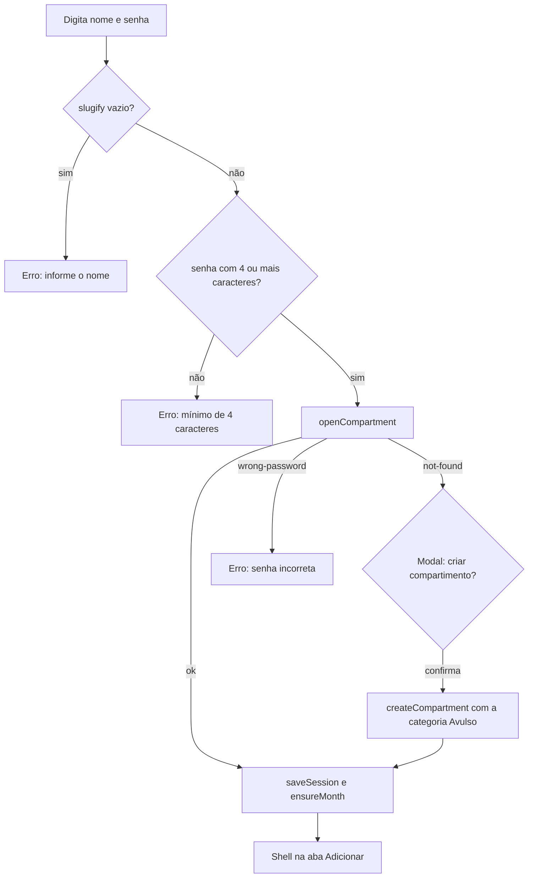
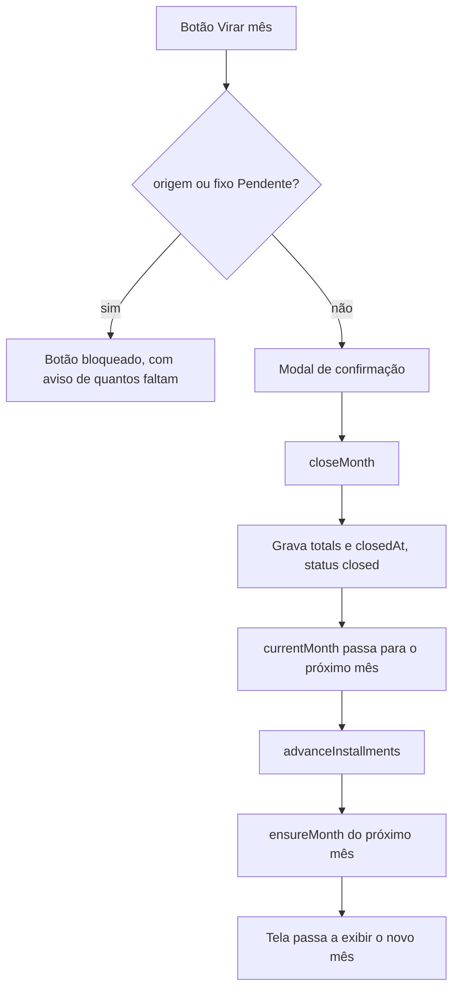

# 7. Fluxos da aplicação

## 7.1 Entrar ou criar compartimento

Pontos que costumam ser esquecidos:

- o nome vira id por `slugify`, então "Casa", "casa" e "CASA " são o mesmo
  compartimento;
- não existe recuperação de senha. Sem a senha, não há acesso ao compartimento;
- erro de rede tem mensagem própria ("Não foi possível conectar"), diferente de
  senha incorreta.

## 7.2 Restaurar sessão

Ao abrir o app: lê o `localStorage`, decifra a senha com a chave do dispositivo,
revalida com `openCompartment` e chama `ensureMonth`. Qualquer falha limpa a
sessão e cai no login. Enquanto isso, a tela mostra "Abrindo seu compartimento…".

## 7.3 Adicionar um gasto variável

1. A categoria padrão já vem selecionada; o usuário pode trocar no chip ou criar
   uma categoria na hora pelo chip "+ categoria".
2. Digita o valor no campo grande (só dígitos, formatação automática).
3. Descrição é opcional.
4. Data: por padrão hoje. O botão de calendário abre o seletor nativo; com outra
   data escolhida, o botão fica com borda laranja e a linha "Data:" mostra a data
   escolhida em laranja. O botão de borracha volta para hoje.
5. Origem: os chips de origem ficam logo acima do botão de adicionar, com a
   origem padrão pré-selecionada. Sem origem cadastrada, a linha não aparece e o
   lançamento é gravado com `originId: null`.
6. "Adicionar em ..." grava o lançamento com `createdAt` vindo da data escolhida
   e `week` vindo da semana corrente do mês, e mostra o flash de confirmação por
   2,5 segundos.

O card abaixo do formulário atualiza sozinho (dados em tempo real) e mostra a
semana corrente do mês, quanto resta na semana e no mês da categoria
acompanhada, e os totais de fixos e variáveis. A categoria acompanhada tem
seletor próprio, independente do chip que escolhe onde o gasto entra, e fica
guardada no compartimento: quem abre em outro aparelho vê a mesma.

### Virar a semana

A semana do mês (1 a 4) é contada pelo usuário, não pelo dia do calendário. O
mês nasce na semana 1 e só avança quando ele toca em "Virar semana", no card de
acompanhamento, e confirma. Os gastos já lançados ficam na semana em que
entraram; só os próximos vão para a semana nova. Na semana 4 o botão fica
desligado, porque a semana volta para 1 na virada do mês.

Quando o dia é domingo e a semana ainda não virou naquele dia, o card mostra um
aviso sugerindo a virada. O app nunca vira a semana sozinho: lembrar é
reversível, virar não.

## 7.3.1 Histórico do mês (aba Adicionar)

No rodapé da aba Adicionar, abaixo dos dois cards de estatística, fica o
histórico do mês em duas subabas:

- **Variáveis** (padrão): todos os lançamentos do mês, do mais recente para o
  mais antigo, com data, semana, categoria e o selo da origem (glifo colorido
  mais nome). Busca por texto (sem acento e sem caixa, cobrindo descrição,
  categoria e origem) e filtros de categoria, origem ("Sem origem" inclusive) e
  faixa de data.
- **Fixos**: as linhas de gasto fixo do mês, com selo de status, selo da origem
  (quando o cadastro tem uma), ideal e busca por nome, descrição ou origem. O
  selo da origem aqui não abre troca: ela vem do cadastro e muda na aba
  Gerenciar.

Falha de gravação (recusa do banco ou falta de rede) aparece na tela: no modal,
quando existe um, e no rodapé do card na edição no lugar, que não tem botão de
confirmar.

Na subaba de variáveis, o lápis da linha abre o modal de edição do lançamento,
com descrição, valor, data do gasto, semana, categoria e origem em um formulário
só. É o único caminho de edição de um lançamento: os selos de categoria e de
origem são apenas leitura. A data pode ser de outro mês; o lançamento continua no
mês em que foi feito, e a hora original é preservada para os lançamentos do mesmo
dia manterem a ordem de inclusão. A semana tem campo próprio, com a corrente
marcada como "(atual)": quem lançou um gasto antes de virar a semana conserta
por ali, sem mexer na data.

O botão de seleção liga o modo de lote: marque os lançamentos, use
"Reclassificar" e a troca de categoria ou de origem vale para todos os marcados.
Só o que está visível na lista entra na conta, então mudar o filtro depois de
marcar não altera nada fora da tela. No modo de seleção os botões de editar e
excluir saem das linhas, porque ali o toque é para marcar.

Na subaba de fixos, valor e descrição da linha do mês continuam editáveis no
lugar: ali o cadastro é que manda, e a edição completa dele fica na tela
Gerenciar. A remoção passa por confirmação nas duas subabas. Excluir um
lançamento variável apaga o documento; remover um gasto fixo usa o mesmo caminho
da tela Gerenciar (sai do mês em aberto e dos próximos meses), porque apagar só a
linha do mês faria o gasto voltar na próxima reconciliação. Meses fechados não
são alterados, e a edição só é liberada com o mês em aberto.

## 7.4 Gerenciar cadastros

Gasto fixo: modal com nome, descrição, valor, ideal, origem e parcela ("2 de 4").
A origem usa a mesma fileira de chips do novo gasto, com a origem padrão já
escolhida em um cadastro novo e o chip "Sem origem" para deixar o gasto sem uma.
Na edição vale o que está gravado, e origem que foi removida do cadastro continua
na fileira para não ser apagada sem querer. Ao salvar, o cadastro é atualizado e o
mês corrente em aberto recebe o reflexo (a linha é criada se ainda não existir).
Valor e ideal também podem ser editados direto na lista, que mostra o selo da
origem ao lado do nome.

Categoria: nome e ideal editáveis no lugar, setas para reordenar (a ordem vale
para os chips da tela de novo gasto), "tornar padrão" para transferir o papel da
categoria pré-selecionada e X para remover.

Origem do gasto: modal com nome, grade de ícones (Pix, transferência, cartão,
dinheiro, investimento, débito automático e boleto) e fileira de tons, que mostra
o ícone escolhido em cada cor. A lista tem "tornar padrão", setas de ordem e
remoção. A primeira origem criada já vira a padrão. Remover desativa: os
lançamentos que já usaram a origem seguem com o nome dela no histórico.

Remoção é sempre desativação (`active: false`), com efeito no mês em aberto:

- gasto fixo: a linha do mês some;
- categoria: a linha some apenas se não houver lançamento no mês. Com
  lançamentos, ela fica até o mês virar, para não sumir com valores já gastos.

Meses fechados nunca são alterados por mudança de cadastro.

## 7.5 Aba Pagamento

A aba tem dois cards, na ordem em que o mês é resolvido:

1. **Origens do gasto.** Uma linha por origem cadastrada, na ordem do cadastro,
   com o total do mês daquela origem (os gastos fixos dela mais a soma dos
   lançamentos variáveis, as duas parcelas visíveis ao lado) e o status. O total
   é o valor da fatura: gasto fixo debitado no cartão entra na conta do cartão.
   É a pergunta "esta fatura já foi paga?". Origem cadastrada aparece na tabela
   mesmo antes de ter linha no mês, com o status `Pendente` que ela ganha ao
   nascer; a linha é criada na primeira troca de status.
2. **Gastos fixos.** Uma linha por gasto fixo, com ideal e valor editáveis no
   lugar, o selo da origem e o status.

Trocar o status de uma origem aplica o mesmo status aos gastos fixos que saem
dela, em uma gravação só. Depois disso, cada gasto fixo ainda pode ser ajustado
na tabela de baixo: a cascata é um atalho, não uma amarra.

Lançamento sem origem aparece em uma linha "Sem origem", só de leitura: sem
origem não há onde guardar status. Dar uma origem a ele no histórico o leva para
a linha da origem escolhida.

Não existe card de categorias na aba: a categoria é orçamento (ideal e
estatísticas), não forma de pagamento. O ideal por categoria é editado na tela
Gerenciar, e o histórico de lançamentos fica na aba Adicionar.

Só o mês corrente em aberto é editável; meses anteriores são consultáveis, em
modo leitura.

Efeitos por status estão em [06-banco-de-dados.md](06-banco-de-dados.md). O que
importa no fluxo:

- `Pendente` em origem ou em gasto fixo bloqueia o botão "Virar mês", e o app
  informa quantos itens faltam;
- `Ignorar` tira do gasto do mês o que está na linha, mantendo o ideal: na
  origem, tudo que saiu dela; no gasto fixo, o valor daquela linha. A linha fica
  com o valor riscado.

## 7.6 Virar o mês

`advanceInstallments` incrementa a parcela atual dos gastos parcelados; quem
estava na última parcela é desativado e não aparece no mês seguinte. O mês novo
nasce na semana 1, qualquer que seja o dia do calendário em que a virada
aconteceu.

## 7.7 Mover o mês de referência

Ao navegar para outro mês, aparece o botão "Mover o mês atual para ...". A ação
leva **todo o conteúdo do mês em aberto** para o mês escolhido: linhas de gastos
fixos (com o valor e o status como estavam), linhas de categorias, linhas de
origens (com o status) e lançamentos, cada documento com o mesmo id. É a correção para quem trabalhou o mês inteiro na
referência errada.

- Mês de destino sem conteúdo: uma confirmação.
- Mês de destino com conteúdo: duas confirmações, porque o que está lá é apagado
  e substituído pelo conteúdo que vem. Ação sem desfazer.

O mês de origem fica vazio e deixa de ser o mês em aberto. Ele continua
existindo na navegação, mas some do comparativo mensal, que só mostra mês com
totais.

Os cadastros de gastos fixos, categorias e origens **não são movidos e nem
precisam**: eles pertencem ao compartimento e valem para qualquer mês. Depois de
mover, o destino é reconciliado com eles, então cadastro ativo que ainda não
tinha linha no mês ganha uma, com status `Pendente`.

Parcelas não avançam: mover a referência é uma correção, não uma virada de mês.

## 7.8 Estatísticas

- **Resumo do mês**: o mês visualizado com gasto, ideal, percentual, barra e a
  linha de detalhe com fixos, variáveis e o restante (ou o excedido, em
  vermelho). Mês fechado usa os totais gravados. O mesmo card aparece na aba
  Adicionar, com o mês em aberto.
- **Categorias do mês**: gasto por categoria com o ideal e o percentual.
- **Semanas**: as quatro semanas do mês visualizado, cada uma com o gasto contra
  o ideal semanal (ideal das variáveis dividido por 4). A semana corrente ganha
  o selo "atual" enquanto o mês está em aberto.

## 7.9 Offline e instalação

O app é um PWA instalável. O shell é pré-cacheado pelo service worker e os dados
vêm do cache offline do SDK do Firestore em IndexedDB: sem rede, os últimos dados
carregados continuam visíveis e as escritas sincronizam ao reconectar. Uma versão
nova é aplicada automaticamente no próximo carregamento após o deploy.
