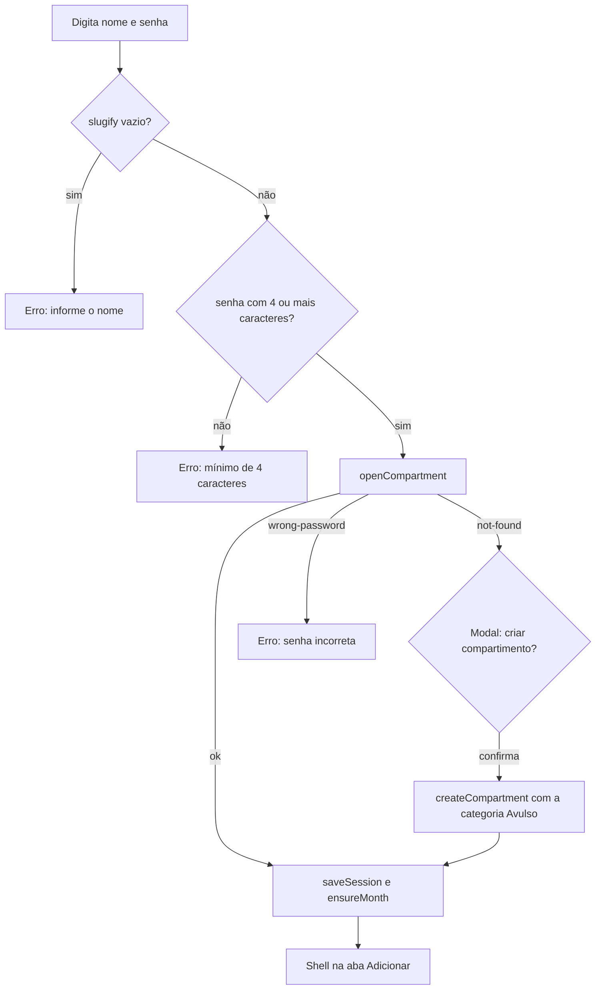
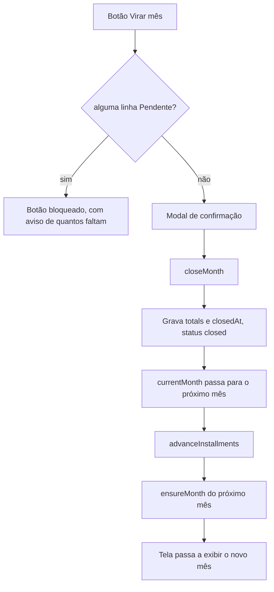

# 7. Fluxos da aplicação

## 7.1 Entrar ou criar compartimento

Pontos que costumam ser esquecidos:

- o nome vira id por `slugify`, então "Casa", "casa" e "CASA " são o mesmo
  compartimento;
- não existe recuperação de senha. Sem a senha, não há acesso ao compartimento;
- erro de rede tem mensagem própria ("Não foi possível conectar"), diferente de
  senha incorreta.

## 7.2 Restaurar sessão

Ao abrir o app: lê o `localStorage`, decifra a senha com a chave do dispositivo,
revalida com `openCompartment` e chama `ensureMonth`. Qualquer falha limpa a
sessão e cai no login. Enquanto isso, a tela mostra "Abrindo seu compartimento…".

## 7.3 Adicionar um gasto variável

1. A categoria padrão já vem selecionada; o usuário pode trocar no chip ou criar
   uma categoria na hora pelo chip "+ categoria".
2. Digita o valor no campo grande (só dígitos, formatação automática).
3. Descrição é opcional.
4. Data: por padrão hoje. O botão de calendário abre o seletor nativo; com outra
   data escolhida, o botão fica com borda laranja e a linha "Data:" mostra a data
   escolhida em laranja. O botão de borracha volta para hoje.
5. Origem: os chips de origem ficam logo acima do botão de adicionar, com a
   origem padrão pré-selecionada. Sem origem cadastrada, a linha não aparece e o
   lançamento é gravado com `originId: null`.
6. "Adicionar em ..." grava o lançamento com `createdAt` e `week` derivados da
   data escolhida, e mostra o flash de confirmação por 2,5 segundos.

O card de informe abaixo do formulário atualiza sozinho (dados em tempo real) e
mostra quanto resta na semana e no mês da categoria, além dos totais de fixos e
variáveis do mês.

## 7.3.1 Histórico do mês (aba Adicionar)

No rodapé da aba Adicionar, abaixo dos dois cards de estatística, fica o
histórico do mês em duas subabas:

- **Variáveis** (padrão): todos os lançamentos do mês, do mais recente para o
  mais antigo, com data, semana, categoria e o selo da origem (glifo colorido
  mais nome). Busca por texto (sem acento e sem caixa, cobrindo descrição,
  categoria e origem) e filtros de categoria, origem ("Sem origem" inclusive) e
  faixa de data.
- **Fixos**: as linhas de gasto fixo do mês, com selo de status, ideal e busca
  por nome ou descrição.

Nas duas subabas, valor e descrição são editáveis no lugar e a remoção passa por
confirmação. Excluir um lançamento variável apaga o documento; remover um gasto
fixo usa o mesmo caminho da tela Gerenciar (sai do mês em aberto e dos próximos
meses), porque apagar só a linha do mês faria o gasto voltar na próxima
reconciliação. Meses fechados não são alterados, e a edição só é liberada com o
mês em aberto.

## 7.4 Gerenciar cadastros

Gasto fixo: modal com nome, descrição, valor, ideal e parcela ("2 de 4"). Ao
salvar, o cadastro é atualizado e o mês corrente em aberto recebe o reflexo (a
linha é criada se ainda não existir). Valor e ideal também podem ser editados
direto na lista.

Categoria: nome e ideal editáveis no lugar, setas para reordenar (a ordem vale
para os chips da tela de novo gasto), "tornar padrão" para transferir o papel da
categoria pré-selecionada e X para remover.

Origem do gasto: modal com nome, grade de ícones (Pix, transferência, cartão,
dinheiro, investimento, débito automático e boleto) e fileira de tons, que mostra
o ícone escolhido em cada cor. A lista tem "tornar padrão", setas de ordem e
remoção. A primeira origem criada já vira a padrão. Remover desativa: os
lançamentos que já usaram a origem seguem com o nome dela no histórico.

Remoção é sempre desativação (`active: false`), com efeito no mês em aberto:

- gasto fixo: a linha do mês some;
- categoria: a linha some apenas se não houver lançamento no mês. Com
  lançamentos, ela fica até o mês virar, para não sumir com valores já gastos.

Meses fechados nunca são alterados por mudança de cadastro.

## 7.5 Aba Pagamento

Para cada linha (fixo ou categoria) o usuário ajusta o status e, nos fixos, o
valor efetivo. Só o mês corrente em aberto é editável; meses anteriores são
consultáveis, em modo leitura.

Efeitos por status estão em [06-banco-de-dados.md](06-banco-de-dados.md). O que
importa no fluxo:

- `Pendente` em qualquer linha bloqueia o botão "Virar mês", e o app informa
  quantos itens faltam;
- `Ignorar` tira o valor da soma do gasto do mês, mantendo o ideal. A linha fica
  com o valor riscado, e nas estatísticas a categoria ganha o selo "ignorado".

Expandir uma categoria lista os lançamentos com data, semana, descrição e valor,
com opção de excluir.

## 7.6 Virar o mês

`advanceInstallments` incrementa a parcela atual dos gastos parcelados; quem
estava na última parcela é desativado e não aparece no mês seguinte.

## 7.7 Definir outro mês como o mês em aberto

Ao navegar para outro mês, aparece o botão "Definir ... como mês em aberto".

- Mês ainda sem dados: uma confirmação. Ele é criado a partir dos cadastros e
  passa a receber os lançamentos.
- Mês com dados: duas confirmações, porque os dados existentes (incluindo os
  lançamentos) são apagados e o mês é reiniciado a partir dos cadastros atuais.
  Ação sem desfazer.

O mês que era o aberto continua com todos os dados, apenas deixa de receber
novos lançamentos.

## 7.8 Estatísticas

- **Comparativo mensal**: até seis meses, com gasto, ideal, percentual, barra e a
  linha de detalhe com fixos, variáveis e o restante (ou o excedido, em
  vermelho). Meses fechados usam os totais gravados.
- **Categorias do mês**: gasto por categoria com o ideal e o percentual.
- **Semanas**: as quatro semanas do mês visualizado comparadas com as do mês
  anterior, contra o ideal semanal (ideal das variáveis dividido por 4).

## 7.9 Offline e instalação

O app é um PWA instalável. O shell é pré-cacheado pelo service worker e os dados
vêm do cache offline do SDK do Firestore em IndexedDB: sem rede, os últimos dados
carregados continuam visíveis e as escritas sincronizam ao reconectar. Uma versão
nova é aplicada automaticamente no próximo carregamento após o deploy.
