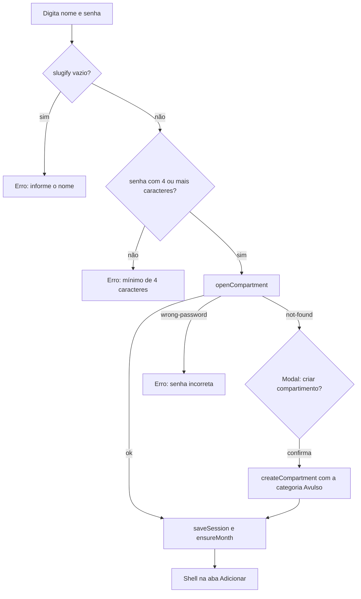
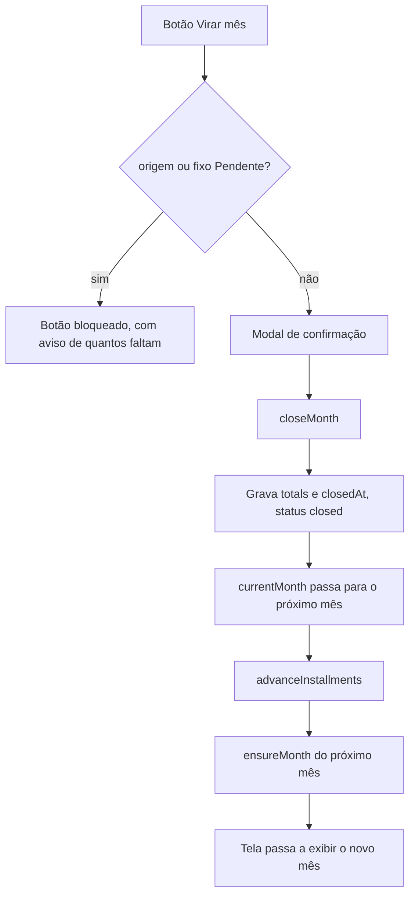
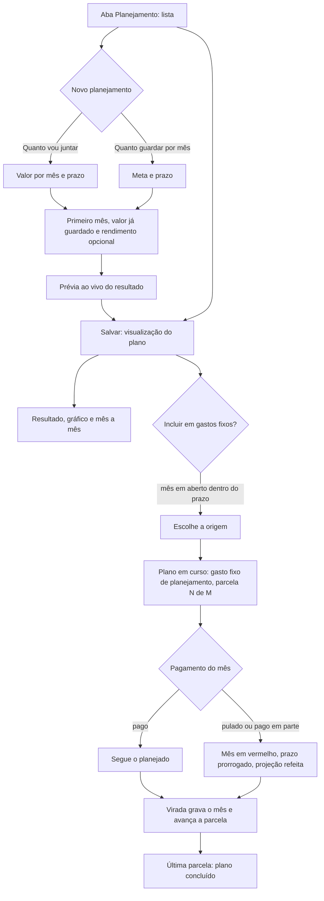

# 7. Fluxos da aplicação

## 7.1 Entrar ou criar compartimento

```mermaid
flowchart TD
  A["Digita nome e senha"] --> B{"slugify vazio?"}
  B -- sim --> C["Erro: informe o nome"]
  B -- não --> D{"senha com 4 ou mais caracteres?"}
  D -- não --> E["Erro: mínimo de 4 caracteres"]
  D -- sim --> F["openCompartment"]
  F -- "not-found" --> G{"Modal: criar compartimento?"}
  F -- "wrong-password" --> H["Erro: senha incorreta"]
  F -- "ok" --> I["saveSession e ensureMonth"]
  G -- confirma --> J["createCompartment com a categoria Avulso"]
  J --> I
  I --> K["Shell na aba Adicionar"]
```

Pontos que costumam ser esquecidos:

- o nome vira id por `slugify`, então "Casa", "casa" e "CASA " são o mesmo
  compartimento;
- não existe recuperação de senha. Sem a senha, não há acesso ao compartimento;
- erro de rede tem mensagem própria ("Não foi possível conectar"), diferente de
  senha incorreta.

## 7.2 Restaurar sessão

Ao abrir o app: lê o `localStorage`, decifra a senha com a chave do dispositivo,
revalida com `openCompartment` e chama `ensureMonth`. Qualquer falha limpa a
sessão e cai no login. Enquanto isso, a tela mostra "Abrindo seu compartimento…".

## 7.3 Adicionar um gasto variável

1. A categoria padrão já vem selecionada; o usuário pode trocar no chip ou criar
   uma categoria na hora pelo chip "+ categoria".
2. Digita o valor no campo grande (só dígitos, formatação automática).
3. Descrição é opcional.
4. Data: por padrão hoje. O botão de calendário abre o seletor nativo; com outra
   data escolhida, o botão fica com borda laranja e a linha "Data:" mostra a data
   escolhida em laranja. O botão de borracha volta para hoje.
5. Origem: os chips de origem ficam logo acima do botão de adicionar, com a
   origem padrão pré-selecionada. Sem origem cadastrada, a linha não aparece e o
   lançamento é gravado com `originId: null`.
6. "Adicionar em ..." grava o lançamento com `createdAt` vindo da data escolhida
   e `week` vindo da semana corrente do mês, e mostra o flash de confirmação por
   2,5 segundos.

### Card de estatísticas

O card abaixo do formulário atualiza sozinho (dados em tempo real) e traz três
abas:

1. **Resumo do mês** (a padrão): o total gasto contra a renda líquida do mês
   (ou contra o previsto, quando não há renda informada), com fixos, variáveis
   e o restante. É o mesmo card da aba Estatísticas, embutido aqui.
2. **Gasto por Categoria, Semana N**: quanto resta na semana e no mês da
   categoria acompanhada.
3. **Gasto por Origem, Semana N**: o mesmo para a origem acompanhada. O gasto do
   mês é o total que a aba Pagamento mostra para ela (os gastos fixos dela mais
   os lançamentos), e a semana conta só os lançamentos, porque gasto fixo é do
   mês inteiro e não tem semana; quando a origem tem fixos, uma linha explica a
   diferença. Sem origem cadastrada a aba não aparece.

A categoria e a origem acompanhadas têm seletor próprio, independente dos chips
que escolhem onde o gasto entra. A aba aberta e os dois seletores ficam
guardados no compartimento: a tela reabre como foi deixada, em qualquer
aparelho.

A semana corrente, o botão "Virar semana" e o aviso de domingo ficam fora das
abas, no topo do card: o lembrete de virar a semana não pode depender de o
usuário estar na aba certa.

### Virar a semana

A semana do mês (1 a 4) é contada pelo usuário, não pelo dia do calendário. O
mês nasce na semana 1 e só avança quando ele toca em "Virar semana", no topo do
card de estatísticas, e confirma. Os gastos já lançados ficam na semana em que
entraram; só os próximos vão para a semana nova. Na semana 4 o botão fica
desligado, porque a semana volta para 1 na virada do mês.

Quando o dia é domingo e a semana ainda não virou naquele dia, o card mostra um
aviso sugerindo a virada. O app nunca vira a semana sozinho: lembrar é
reversível, virar não.

## 7.3.1 Histórico do mês (aba Adicionar)

No rodapé da aba Adicionar, abaixo do card de estatísticas, fica o
histórico do mês em duas subabas:

- **Variáveis** (padrão): todos os lançamentos do mês, do mais recente para o
  mais antigo, com data, semana, categoria e o selo da origem (glifo colorido
  mais nome). Busca por texto (sem acento e sem caixa, cobrindo descrição,
  categoria e origem) e filtros de categoria, origem ("Sem origem" inclusive) e
  faixa de data.
- **Fixos**: as linhas de gasto fixo do mês, com selo de status, selo da origem
  (quando o cadastro tem uma), ideal e busca por nome, descrição ou origem. O
  selo da origem aqui não abre troca: ela vem do cadastro e muda na aba
  Gerenciar.

Falha de gravação (recusa do banco ou falta de rede) aparece na tela: no modal,
quando existe um, e no rodapé do card na edição no lugar, que não tem botão de
confirmar.

Na subaba de variáveis, o lápis da linha abre o modal de edição do lançamento,
com descrição, valor, data do gasto, semana, categoria e origem em um formulário
só. É o único caminho de edição de um lançamento: os selos de categoria e de
origem são apenas leitura. A data pode ser de outro mês; o lançamento continua no
mês em que foi feito, e a hora original é preservada para os lançamentos do mesmo
dia manterem a ordem de inclusão. A semana tem campo próprio, com a corrente
marcada como "(atual)": quem lançou um gasto antes de virar a semana conserta
por ali, sem mexer na data.

O botão de seleção liga o modo de lote: marque os lançamentos, use
"Reclassificar" e a troca de categoria ou de origem vale para todos os marcados.
Só o que está visível na lista entra na conta, então mudar o filtro depois de
marcar não altera nada fora da tela. No modo de seleção os botões de editar e
excluir saem das linhas, porque ali o toque é para marcar.

Na subaba de fixos, valor e descrição da linha do mês continuam editáveis no
lugar: ali o cadastro é que manda, e a edição completa dele fica na tela
Gerenciar. A remoção passa por confirmação nas duas subabas. Excluir um
lançamento variável apaga o documento; remover um gasto fixo usa o mesmo caminho
da tela Gerenciar (sai do mês em aberto e dos próximos meses), porque apagar só a
linha do mês faria o gasto voltar na próxima reconciliação. Meses fechados não
são alterados, e a edição só é liberada com o mês em aberto.

## 7.4 Gerenciar cadastros

Renda mensal líquida: primeira seção da tela, editável no lugar. Salvar grava no
compartimento e reflete no mês corrente em aberto (`setMonthlyIncome`); meses já
fechados ficam com a renda que tinham, e os próximos nascem com a nova. Ao lado
da renda a seção mostra o previsto de gastos (valor dos fixos mais o ideal das
categorias) e a sobra prevista, em vermelho quando o previsto passa da renda.

Gasto fixo: modal com nome, descrição, valor, origem e parcela ("2 de 4").
A origem usa a mesma fileira de chips do novo gasto, com a origem padrão já
escolhida em um cadastro novo e o chip "Sem origem" para deixar o gasto sem uma.
Na edição vale o que está gravado, e origem que foi removida do cadastro continua
na fileira para não ser apagada sem querer. Ao salvar, o cadastro é atualizado e o
mês corrente em aberto recebe o reflexo (a linha é criada se ainda não existir).
O valor também pode ser editado direto na lista, que mostra o selo da origem ao
lado do nome. Não há campo de ideal: conta que se repete todo mês já é o próprio
planejamento, então o valor do fixo é o previsto dele.

O gasto fixo de planejamento (criado pela aba Planejamento) aparece na lista
com o selo "planejamento" e os meses que faltam, mas sem edição: sem lápis, sem
remoção e com o valor só para leitura, com a nota "Gerenciado na aba
Planejamento". Ele espelha o plano, e mudar o valor ou as parcelas aqui o faria
discordar do plano; tudo isso passa pela aba Planejamento.

Categoria: nome e ideal editáveis no lugar, setas para reordenar (a ordem vale
para os chips da tela de novo gasto), "tornar padrão" para transferir o papel da
categoria pré-selecionada e X para remover.

Origem do gasto: modal com nome, gasto ideal do mês, grade de ícones (Pix,
transferência, cartão, dinheiro, investimento, débito automático e boleto) e
fileira de tons, que mostra o ícone escolhido em cada cor. O ideal também é
editável direto na lista, que ainda tem "tornar padrão", setas de ordem e
remoção. A primeira origem criada já vira a padrão. Remover desativa: os
lançamentos que já usaram a origem seguem com o nome dela no histórico.

O ideal da origem funciona como o da categoria: vale para todo mês, é copiado
para a linha do mês em aberto e alimenta uma comparação própria na aba
Estatísticas. Ele não entra no ideal do mês, porque origem e categoria são dois
eixos do mesmo dinheiro e somar os dois contaria cada gasto duas vezes.

Remoção é sempre desativação (`active: false`), com efeito no mês em aberto:

- gasto fixo: a linha do mês some;
- categoria: a linha some apenas se não houver lançamento no mês. Com
  lançamentos, ela fica até o mês virar, para não sumir com valores já gastos.

Meses fechados nunca são alterados por mudança de cadastro.

## 7.5 Aba Pagamento

A aba tem dois cards, na ordem em que o mês é resolvido:

1. **Origens do gasto.** Uma linha por origem cadastrada, na ordem do cadastro,
   com o gasto ideal do mês, o total do mês daquela origem (os gastos fixos dela
   mais a soma dos lançamentos variáveis, as duas parcelas visíveis ao lado) e o
   status. O total é o valor da fatura: gasto fixo debitado no cartão entra na
   conta do cartão. É a pergunta "esta fatura já foi paga?". O ideal é editável
   no lugar, como o do gasto fixo, e muda só o mês visualizado: o cadastro segue
   com o ideal que vale para os próximos meses. Origem cadastrada aparece na
   tabela mesmo antes de ter linha no mês, com o status `Pendente` e o ideal do
   cadastro, que é o que ela ganha ao nascer; a linha é criada na primeira
   edição de status ou de ideal.
2. **Gastos fixos.** Uma linha por gasto fixo, com o valor editável no lugar, o
   selo da origem e o status. Sem coluna de ideal: o valor já é o previsto.

**Gasto fixo de planejamento no Pagamento.** O valor vem do plano e não é
editável. O status é o que o plano em curso lê de cada mês:

- `Pago`, `Agendado/Automático` e os demais: o valor inteiro foi guardado;
- `Ignorar` ou `Sem gasto`: o mês foi pulado, nada guardado;
- `Parcialmente pago`: abre um modal que pede quanto foi guardado (menos que o
  planejado). A célula passa a mostrar "R$ 300,00 de R$ 500,00", e o mês conta
  só o que foi guardado no gasto.

Mês pulado ou pago em parte prorroga o plano na hora: as parcelas do gasto fixo
e o selo "faltam N meses" já mudam, e a aba Planejamento mostra o mês em
vermelho com o novo fim.

Trocar o status de uma origem aplica o mesmo status aos gastos fixos que saem
dela, em uma gravação só. Depois disso, cada gasto fixo ainda pode ser ajustado
na tabela de baixo: a cascata é um atalho, não uma amarra.

Lançamento sem origem aparece em uma linha "Sem origem", só de leitura e sem
ideal: sem origem não há onde guardar status nem planejado. Dar uma origem a ele
no histórico o leva para a linha da origem escolhida.

Não existe card de categorias na aba: a categoria é orçamento (ideal e
estatísticas), não forma de pagamento. O ideal por categoria é editado na tela
Gerenciar, e o histórico de lançamentos fica na aba Adicionar.

Só o mês corrente em aberto é editável; meses anteriores são consultáveis, em
modo leitura.

Efeitos por status estão em [06-banco-de-dados.md](06-banco-de-dados.md). O que
importa no fluxo:

- `Pendente` em origem ou em gasto fixo bloqueia o botão "Virar mês", e o app
  informa quantos itens faltam;
- `Ignorar` tira do gasto do mês o que está na linha, mantendo o ideal: na
  origem, tudo que saiu dela; no gasto fixo, o valor daquela linha. A linha fica
  com o valor riscado.

## 7.6 Virar o mês

```mermaid
flowchart TD
  A["Botão Virar mês"] --> B{"origem ou fixo Pendente?"}
  B -- sim --> C["Botão bloqueado, com aviso de quantos faltam"]
  B -- não --> D["Modal de confirmação"]
  D --> E["closeMonth"]
  E --> F["Grava totals e closedAt, status closed"]
  F --> G["currentMonth passa para o próximo mês"]
  G --> H["advanceInstallments"]
  H --> I["ensureMonth do próximo mês"]
  I --> J["Tela passa a exibir o novo mês"]
```

Antes de avançar as parcelas, a virada grava em cada plano em curso o que
aconteceu no mês que fechou (o planejado e o guardado) e acerta o gasto fixo de
planejamento: parcela, total de parcelas (com os meses extras) e o valor do
próximo mês, que no último mês extra é só o resto. Uma falha aqui não segura a
virada.

`advanceInstallments` incrementa a parcela atual dos gastos parcelados; quem
estava na última parcela é desativado e não aparece no mês seguinte. O mês novo
nasce na semana 1, qualquer que seja o dia do calendário em que a virada
aconteceu, e com a renda líquida copiada do cadastro do compartimento: o mês que
acabou de fechar fica com a renda que tinha.

## 7.7 Mover o mês de referência

Ao navegar para outro mês, aparece o botão "Mover o mês atual para ...". A ação
leva **todo o conteúdo do mês em aberto** para o mês escolhido: linhas de gastos
fixos (com o valor e o status como estavam), linhas de categorias, linhas de
origens (com o status) e lançamentos, cada documento com o mesmo id. É a correção para quem trabalhou o mês inteiro na
referência errada.

- Mês de destino sem conteúdo: uma confirmação.
- Mês de destino com conteúdo: duas confirmações, porque o que está lá é apagado
  e substituído pelo conteúdo que vem. Ação sem desfazer.

O mês de origem fica vazio e deixa de ser o mês em aberto. Ele continua
existindo na navegação, mas some do comparativo mensal, que só mostra mês com
totais.

Os cadastros de gastos fixos, categorias e origens **não são movidos e nem
precisam**: eles pertencem ao compartimento e valem para qualquer mês. Depois de
mover, o destino é reconciliado com eles, então cadastro ativo que ainda não
tinha linha no mês ganha uma, com status `Pendente`.

Parcelas não avançam: mover a referência é uma correção, não uma virada de mês.

## 7.8 Estatísticas

- **Resumo do mês**: o mês visualizado com gasto, referência, percentual, barra
  e a linha de detalhe com fixos, variáveis e o restante (ou o quanto passou, em
  vermelho). A referência é a renda líquida do mês quando ela está informada, e
  o ideal planejado quando não está. A barra sai em duas faixas, ouro para os
  fixos e prata para os variáveis, e a linha de detalhe é a legenda das duas
  cores. Mês fechado usa os totais e a renda gravados no mês. O mesmo card
  aparece na aba Adicionar, com o mês em aberto.
- **Categorias do mês**: gasto por categoria com o ideal e o percentual.
- **Origens do mês**: gasto por origem com o ideal e o percentual, no mesmo
  formato das categorias. O gasto da origem é o mesmo total da aba Pagamento
  (os gastos fixos dela mais os lançamentos variáveis), e os dois blocos não se
  somam: são o mesmo dinheiro visto por eixos diferentes (no que se gastou e
  por onde se pagou). Mês fechado antes de existir o acompanhamento por origem
  não tem a lista, e a seção diz isso.
- **Semanas**: as quatro semanas do mês visualizado, cada uma com o gasto contra
  o ideal semanal (ideal das variáveis dividido por 4). A semana corrente ganha
  o selo "atual" enquanto o mês está em aberto.

## 7.9 Planejamento

A aba fica depois de um separador na navegação, porque não é controle do mês: é
projeção do que se guarda por mês ao longo de meses ou anos.

```mermaid
flowchart TD
  A["Aba Planejamento: lista"] --> B{"Novo planejamento"}
  B -- "Quanto vou juntar" --> C["Valor por mês e prazo"]
  B -- "Quanto guardar por mês" --> D["Meta e prazo"]
  C --> E["Primeiro mês, valor já guardado e rendimento opcional"]
  D --> E
  E --> F["Prévia ao vivo do resultado"]
  F --> G["Salvar: visualização do plano"]
  A --> G
  G --> H["Resultado, gráfico e mês a mês"]
  G --> I{"Incluir em gastos fixos?"}
  I -- "mês em aberto dentro do prazo" --> J["Escolhe a origem"]
  J --> K["Plano em curso: gasto fixo de planejamento, parcela N de M"]
  K --> M{"Pagamento do mês"}
  M -- "pago" --> N["Segue o planejado"]
  M -- "pulado ou pago em parte" --> O["Mês em vermelho, prazo prorrogado, projeção refeita"]
  N --> L["Virada grava o mês e avança a parcela"]
  O --> L
  L --> P["Última parcela: plano concluído"]
```

1. **Criar.** Na lista, o usuário escolhe o tipo. "Quanto vou juntar" pede o
   valor guardado por mês; "Quanto guardar por mês" pede o valor a alcançar. Os
   dois pedem o prazo (meses ou anos, até 50 anos), o primeiro mês (o mês em
   aberto, por padrão) e, opcionalmente, o valor que já está guardado.
2. **Rendimento (opcional).** A seção recolhível "Rendimento" escolhe entre sem
   rendimento, taxa ao ano (Tesouro Prefixado, CDB prefixado) e percentual do
   CDI (CDB pós-fixado, Tesouro Selic), com a opção de descontar o imposto de
   renda da tabela regressiva no resgate. Fechada, ela mostra o resumo da taxa.
3. **Prévia.** O resultado aparece ao vivo abaixo do formulário: o valor no fim
   do prazo (líquido, com imposto) ou o valor por mês para chegar à meta, mais
   total depositado, rendimento e imposto.
4. **Ver.** Salvar leva à visualização: resultado, gráfico (saldo em ouro e,
   com rendimento, o total depositado em grafite; tocar no gráfico mostra o mês)
   e a listagem mês a mês por ano, com o mês em aberto marcado.
   Até aqui o plano não mexe no mês nem nos totais: ele é só cadastrado,
   editado e consultado na aba.
5. **Incluir em gastos fixos.** É a única ação que leva o plano ao mês. Com o
   mês em aberto dentro do prazo, o botão cria um gasto fixo de planejamento com
   o valor do mês, a origem escolhida e as parcelas: a do mês em aberto é a
   posição dele no prazo (parcela 3 de 12 no terceiro mês), e o selo mostra
   quantos meses faltam depois deste. O plano passa a estar **em curso**: a
   lista e a visualização dizem isso, e meses do plano antes da inclusão contam
   como guardados.
6. **Em curso.** O que a aba Pagamento disser de cada mês volta para o plano.
   Mês pago segue o planejado. Mês pulado (`Ignorar` ou `Sem gasto`) ou pago em
   parte aparece em vermelho na listagem e no gráfico, e o que faltou vai para
   o fim: o prazo é prorrogado (no "quanto vou juntar", um mês pulado acrescenta
   um mês; no "quanto guardar por mês", os meses extras vão até a meta), a
   projeção do rendimento é refeita e o gasto fixo ganha as parcelas a mais. A
   virada do mês grava o resultado de cada mês no plano.
7. **Editar.** Salvar um plano em curso atualiza nome, valor e parcelas do
   gasto fixo; os meses que já aconteceram ficam como foram pagos, e o primeiro
   mês não pode mudar. O gasto fixo de planejamento não é editado em nenhum
   outro lugar.
8. **Tirar dos gastos fixos e excluir.** "Tirar dos gastos fixos" remove o
   gasto fixo do mês em aberto e dos próximos e encerra o curso: o histórico dos
   meses é descartado e o plano volta a ser só o planejado. Excluir o plano faz
   o mesmo com o gasto fixo dele. Meses fechados nunca mudam.
9. **Concluído.** Na última parcela, a virada desativa o gasto fixo, e o plano
   fica marcado como concluído, com o histórico dos meses.

O plano conta com o que foi pago no Pagamento, e não com um saldo informado: o
foco do app é o controle do mês, e o plano é a conta de onde se chega guardando
aquele valor.

## 7.10 Offline e instalação

O app é um PWA instalável. O shell é pré-cacheado pelo service worker e os dados
vêm do cache offline do SDK do Firestore em IndexedDB: sem rede, os últimos dados
carregados continuam visíveis e as escritas sincronizam ao reconectar. Uma versão
nova é aplicada automaticamente no próximo carregamento após o deploy.
